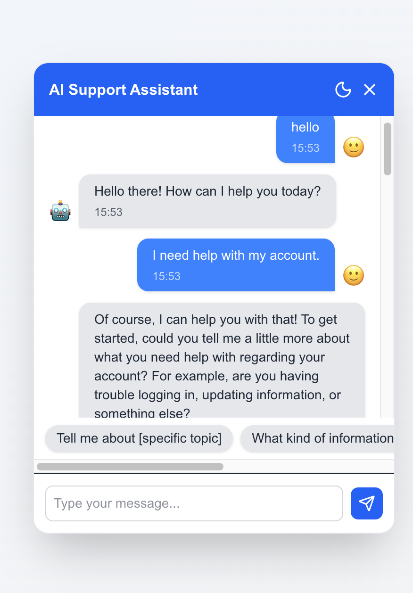

# 🤖 AI-Powered Customer Support Chatbot

A modern, scalable AI-powered support chatbot (like Intercom) built with **FastAPI (Python)** for backend and **Next.js + TailwindCSS** for frontend.  
It streams AI responses in real-time (typing effect), supports **dark mode**, **dynamic suggestions**, and is production-ready.

---

## ✨ Features

- 🚀 **Streaming AI Responses** – Human-like typing effect.  
- 🎨 **Modern UI** – Built with Next.js + TailwindCSS.  
- 🌙 **Dark Mode** – Smooth toggle between light & dark themes.  
- 💡 **Dynamic Suggestions** – AI recommends quick reply buttons.  
- 🕑 **Timestamps & Avatars** – Like professional chat apps.  
- 🔗 **WebSocket based** – Fast, scalable real-time communication.  
- 🔐 **Environment Variables** – Secure API key management.
- ⚡ **Redis Integration** – For caching, real-time chat storage, quick retrieval.  
- 🗄 **MongoDB Integration** – Store users, authentication, chat history.  

---

## 🛠️ Tech Stack

**Frontend:**
- Next.js  
- TailwindCSS  
- Framer Motion (animations)  
- WebSocket client  

**Backend:**
- FastAPI  
- Uvicorn  
- Google Gemini API  
- MongoDB (persistent chat/user storage)  
- Redis (real-time caching & pub/sub) 

---

## 📂 Project Structure

```
ai-chatbot/
│── backend/
│   ├── app/
│   │   ├── routes/         # API + WebSocket routes
│   │   ├── services/       # AI/Redis, MongoDB integration
│   │   └── config.py       # Env config
│   ├── venv/               # Python virtual env
│   └── main.py             # FastAPI entry
│
│── frontend/
│   ├── components/ChatWidget.tsx
│   ├── pages/
│   ├── public/
│   └── package.json
│
│── .gitignore
│── README.md
```

---

## ⚡ Setup Instructions

### 1️⃣ Clone the repo
```bash
git clone https://github.com/karansingla-dev/ai-chatbot
cd ai-chatbot
```

### 2️⃣ Backend Setup (FastAPI + MongoDB + Redis)
```bash
cd backend
python3 -m venv venv
source venv/bin/activate   # On Windows: venv\Scripts\activate
pip install -r requirements.txt
```

Create `.env` file in `backend/`:
```
GEMINI_API_KEY=your_api_key_here
MONGO_URI=mongodb://localhost:27017/ai_chatbot
REDIS_URL=redis://localhost:6379/0
JWT_SECRET=your_secret_here
```

Run backend:
```bash
uvicorn app.main:app --reload
```

👉 Server will run at: `http://localhost:8000`

---

### 3️⃣ Frontend Setup (Next.js)
```bash
cd frontend
npm install
npm run dev
```

👉 App will run at: `http://localhost:3000`

---

## 🎯 Usage

- Click the floating **chat icon** in bottom-right corner.  
- Start chatting with AI 🤖.  
- AI will **stream replies word by word**.  
- Get **suggestions** as quick reply buttons.  
- Chat history is stored in MongoDB, active sessions are cached in Redis.

---

## 📸 Demo (Screenshots / GIF)



---

## 🚀 Future Improvements

- 🎤 Voice input & output  
- 📎 File upload support  
- 👍👎 Feedback system  

---

## 🤝 Contributing

Pull requests are welcome! For major changes, open an issue first.

---

## 📜 License

MIT License © 2025 Karan Singla
